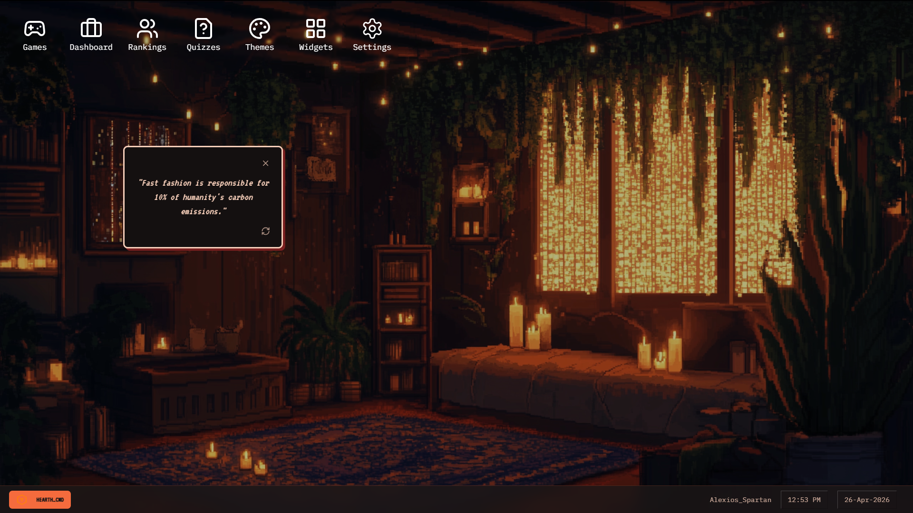

# 🌿 EcoQuest: The Immersive Sustainability Edu-OS



> **"Pioneering the future of environmental education through self-paced, interactive mastery."**

**EcoQuest** is a next-generation gamified learning platform reimagined as a retro-inspired "Edu-OS." It transforms complex sustainability concepts into an interactive, LeetCode-style progression system, blending high-fidelity UI design with data-driven educational mechanics.

---

## 🚀 Key Features

### 🤖 EcoBot: Interactive Authentication
Experience a conversational gateway to the platform.
*   **Chat-Based Onboarding:** No traditional forms. Interact with **EcoBot**, a terminal-style state machine that handles registration and login through a fluid, messaging-based interface.
*   **Contextual Feedback:** Real-time validation and error handling built directly into the chat flow.

### 🖥️ Immersive "Edu-OS" Desktop
A fully functional, window-based operating system designed for focus and immersion.
*   **Themed Environments:** Seamlessly toggle between three distinct visual aesthetics:
    *   **The TVA Archives:** A nostalgic, amber-hued temporal archive.
    *   **The Vault-Ed Program:** A high-contrast, green phosphor terminal for the true retro enthusiast.
    *   **The Lumon Method:** A clean, minimalist "corporate-clinical" blue-and-white design.
*   **Dynamic Widgets:** Draggable desktop widgets including Eco Fact, Daily Briefing, Pixel Weather, and the new **Eco Tiles Calendar** with activity heatmaps, streak paths, quick logging, and predictive tiles.
*   **Window Management:** Draggable, snap-aligned interfaces that mimic a classic desktop environment.

### 🎮 The Game Suite (Learning through Play)
A collection of data-driven simulations with progressive difficulty and randomized scenarios:
1.  **Migration Map [NEW]:** Trace climate-sensitive wildlife routes and analyze ecological drivers.
2.  **Forest Guardian:** Restore degraded ecosystems and manage multi-variable health metrics.
3.  **Ocean Explorer:** Race against time to clean coral reefs using specialized marine equipment.
4.  **Eco City Builder:** A policy-driven sim balancing population growth, happiness, and green energy.
5.  **Recycle Rally:** A high-speed waste-sorting challenge to build real-world recycling habits.

### 🧠 Self-Paced Mastery (LeetCode Style)
*   **Challenge Roadmap:** Progress through structured modules with increasing complexity.
*   **Streaks & Levels:** Maintain daily engagement streaks and level up your "Eco-Champion" rank.
*   **Performance Metrics:** Detailed analytics on quiz accuracy, game session time, and ecological impact literacy.
*   **Leaderboards:** Compete globally and see how you rank against the EcoQuest community.

---

## 🛠️ Technical Excellence

Built with a state-of-the-art stack optimized for performance, security, and scalability:

*   **Framework:** [Next.js 15](https://nextjs.org/) (App Router & Turbopack)
*   **Logic:** [TypeScript](https://www.typescriptlang.org/) for type-safe development.
*   **Database:** [MongoDB](https://www.mongodb.com/) with [Mongoose](https://mongoosejs.com/) for flexible, document-based storage.
*   **Auth:** [NextAuth.js v5](https://next-auth.js.org/) (Beta) for secure, session-based authentication.
*   **Styling:** [Tailwind CSS](https://tailwindcss.com/) + [ShadCN UI](https://ui.shadcn.com/) for a modular design system.
*   **Motion:** [React Draggable](https://github.com/react-grid-layout/react-draggable) + [Tailwind Animate](https://github.com/jamiebuilds/tailwindcss-animate).
*   **Insights:** [Vercel Speed Insights](https://vercel.com/docs/speed-insights) for real-time performance monitoring.

---

## 📂 Documentation & Architecture

Dive deeper into the mechanics and design of EcoQuest:

- [**OVERVIEW.md**](./docs/OVERVIEW.md): Architecture breakdown and demonstration scripts.
- [**TECHSTACK.md**](./docs/TECHSTACK.md): Detailed library choices and technical rationale.
- [**GAMERULES.md**](./docs/GAMERULES.md): Logic and mechanics behind every interactive module.
- [**ARCHITECT.md**](./docs/ARCHITECT.md): Original design vision and UI/UX blueprint.

---

## ⚡ Getting Started (Local Development)

### Prerequisites
- Node.js (v18+)
- MongoDB instance (Local or Atlas)

### Setup
1.  **Clone the repository:**
    ```bash
    git clone https://github.com/IshanG2111/EcoQuest.git
    cd EcoQuest
    ```
2.  **Install dependencies:**
    ```bash
    npm install
    ```
3.  **Configure environment variables:**
    Create a `.env.local` file in the root directory:
    ```env
    MONGODB_URI=your_mongodb_connection_string
    AUTH_SECRET=your_nextauth_secret
    # Additional keys as required by .env.local.example
    ```
4.  **Run the development server:**
    ```bash
    npm run dev
    ```
    Access the app at [http://localhost:9002](http://localhost:9002).

---

## 📄 License

This project is licensed under the MIT License - see the [LICENSE](LICENSE) file for details.

Developed with ❤️ by [IshanG2111](https://github.com/IshanG2111).
