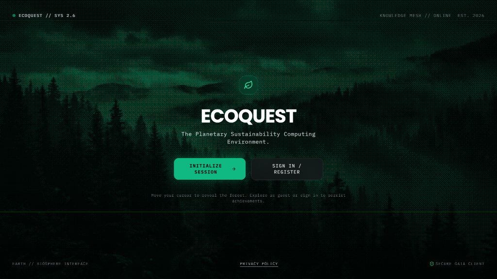
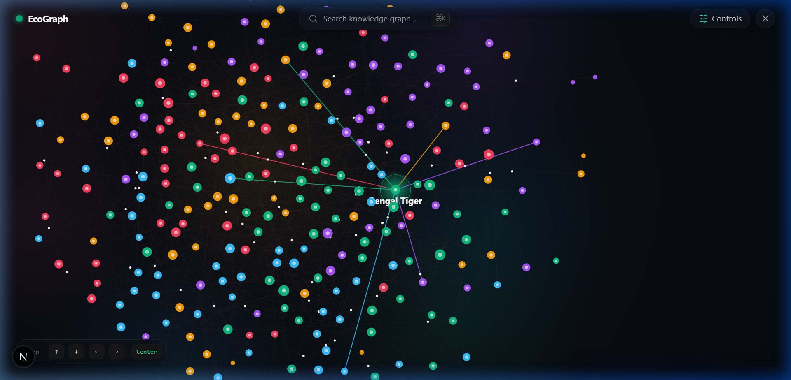
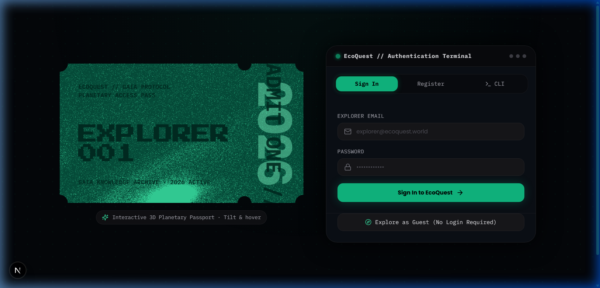
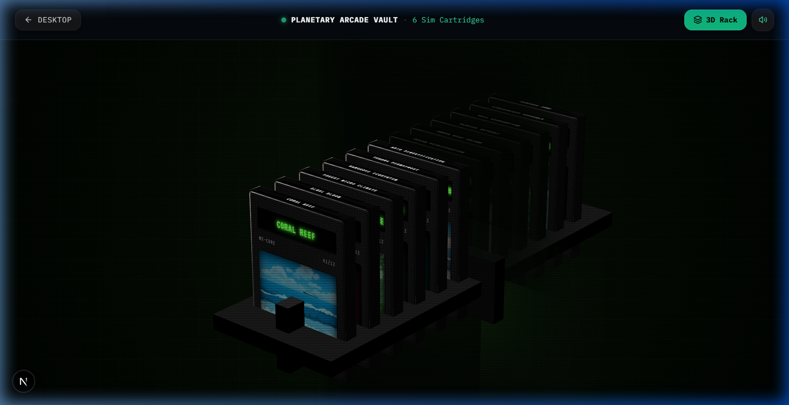

<div align="center">

```
███████╗ ██████╗ ██████╗  ██████╗ ██╗   ██╗███████╗███████╗████████╗
██╔════╝██╔════╝██╔═══██╗██╔═══██╗██║   ██║██╔════╝██╔════╝╚══██╔══╝
█████╗  ██║     ██║   ██║██║   ██║██║   ██║█████╗  ███████╗   ██║
██╔══╝  ██║     ██║   ██║██║▄▄ ██║██║   ██║██╔══╝  ╚════██║   ██║
███████╗╚██████╗╚██████╔╝╚██████╔╝╚██████╔╝███████╗███████║   ██║
╚══════╝ ╚═════╝ ╚═════╝  ╚══▀▀═╝  ╚═════╝ ╚══════╝╚══════╝   ╚═╝
```

### **The World's Most Ambitious Gamified Ecological Learning Universe**
*A full-stack Edu-OS where every quiz, game, and graph is a portal to planetary understanding.*

[](https://nextjs.org/)
[](https://www.typescriptlang.org/)
[](https://firebase.google.com/)
[](https://mongodb.com/)
[](https://ai.google.dev/)
[](https://vercel.com/)

</div>

---

## 📸 Visual Showcase

<div align="center">

### 🌌 Interactive Dither Welcome Terminal

*Real-time 8×8 Bayer ordered dither engine with responsive cursor illumination & system diagnostics*

<br/><br/>

| 🌐 EcoGraph Knowledge Galaxy | 📊 Citizen Dashboard & Planetary Passport |
|:---:|:---:|
|  |  |
| *Force-directed 450+ node ecological food web* | *3D Holographic Passport, XP Progression & Leaderboards* |

<br/>

### 🕹️ Planetary Arcade Vault — 3D Hardware Rack

*Pure gesture/scroll zooming, touch orbit, and 3D physical cartridge crate*

</div>

<!-- 
======================================================================
  ADD YOUR ADDITIONAL SCREENSHOTS HERE:
  Replace the paths below with your custom screenshot filenames:
======================================================================
- Quizzes Challenge Screen:  
- Node Inspector Drawer:     
- Account Settings Screen:   
======================================================================
-->

---

## 🌍 What is EcoQuest?

EcoQuest isn't a tutorial. It isn't a slideshow. It isn't a quiz app.

**EcoQuest is a living planetary operating system** — a full-stack, AI-powered educational universe that transforms the most pressing ecological challenges of the 21st century into an immersive, retro-futuristic gaming environment. Students don't just *learn* about climate change. They *simulate* it, *navigate* it, and *solve* it — wielding real-world data, policy frameworks, and scientific knowledge as their tools.

Built on top of **Next.js 15 App Router**, **Firebase Authentication**, **MongoDB**, **Google Gemini AI**, and a custom **force-directed ecological knowledge graph engine**, EcoQuest redefines what educational software can feel like. Every pixel carries pedagogical intent. Every interaction maps to a real-world environmental concept. Every achievement earns a **digital Planetary Passport** that proves the learner's ecological mastery.

> *"The most dangerous myth in modern education is that learning must be passive. EcoQuest shatters that myth — and replaces it with a universe."*

---

## 🌌 The Interactive Welcome Terminal

Before entering the operating system, learners encounter the **EcoQuest Genesis Terminal** (`/welcome`) — an interactive portal with real-time video dithering.

<div align="center">
  
</div>

- **Live Bayer 8×8 Ordered Dithering Engine** — Streams ambient environmental video quantized into high-contrast retro phosphor tones.
- **Interactive Cursor & Touch Lens** — Illuminates fine pixel details under the mouse or finger with soft ambient light.
- **Session Continuity** — Remembers login status and smoothly routes to the Desktop OS or Passport Portal with sound effects.

---

## 🖥️ The Retro Edu-OS Desktop

EcoQuest boots into a **fully simulated operating system** — not a website, not an app, but a complete *windowed computing environment* with a custom taskbar, multi-theme engine, draggable app windows, real-time widgets, and a true-color dithered animated wallpaper.

<div align="center">
  
</div>

| Feature | Detail |
|---|---|
| **Window Manager** | Draggable, z-indexed, focus-aware windows via React Draggable |
| **OS Taskbar** | Glassmorphic `VERDANT_SYS` Start Menu with user profile, app nav, theme picker, and system tray |
| **System Tray** | Live monospace clock + date pill, sound toggle, widget controller |
| **Multi-Theme Engine** | Verdant Grove (Earth) · Ember Hearth (Fire) · Abyssal Tide (Water) — instant theme synchronization |
| **True-Color Dither Wallpaper** | Real-time per-channel RGB Bayer matrix dither shader over `/videos/desktop.mp4` |
| **CRT Aesthetics** | Phosphor glow, scanlines, retro bezels, flicker effects |
| **Mobile Responsive** | Full UX optimization for iOS/Android — touch-friendly controls, adaptive loader, and compact taskbar |

### 🎨 Desktop Themes

```
  Verdant Grove (Earth)    Ember Hearth (Fire)      Abyssal Tide (Water)
  ─────────────────────    ───────────────────      ────────────────────
  Deep forest emeralds     Charcoal ash & flame     Deep ocean midnight
  Lush botanical phosphor  Blazing ember oranges    Luminous cyan currents
  Planetary biosphere      Geothermal energy vault  Marine pelagic abyss
```

---

## 🌐 EcoGraph — The Ecological Knowledge Galaxy

The centerpiece of EcoQuest. **EcoGraph** is a **force-directed, physics-simulated, interactive knowledge graph** containing 450+ real ecological nodes — species, habitats, pollutants, climate trends, and policy frameworks — all interconnected by scientifically-modeled causal edges.

<div align="center">
  
</div>

```
  Bengal Tiger ──lives_in──▶ Sundarbans Delta
       │                           │
  threatened_by              provides blue carbon
       │                           │
       ▼                           ▼
  Sea Level Rise ◀──emits── Thermal Coal Plants
       │                           │
  threatened_by              reduces via
       │                           │
       ▼                           ▼
  Habitat Loss         National Clean Air Programme
```

### 7 Rich Ecological Clusters

| # | Cluster | Key Species & Nodes |
|---|---|---|
| 🌊 | **Sundarbans Mangrove Blue Carbon** | Bengal Tiger, Saltwater Croc, Sundari Tree, Blue Carbon Sequestration, Storm Surge Attenuation |
| ⛰️ | **Western Ghats Montane Rainforest** | Asian Elephant, Lion-Tailed Macaque, Nilgiri Tahr, King Cobra, Elephant Corridors Policy |
| 🏔️ | **Himalayan Cryosphere & Tundra** | Snow Leopard, Himalayan Blue Sheep, Brahma Kamal, Red Panda, Glacial Mass Loss |
| 🌾 | **Kaziranga Brahmaputra Floodplain** | Indian Rhino, Barasingha Swamp Deer, Ganges River Dolphin, Monsoon Shift |
| 🪸 | **Coral Reef & Pelagic Marine** | Staghorn Coral, Whale Shark, Olive Ridley Turtle, Dugong, Ocean Acidification |
| 🏜️ | **Thar Desert & Clean Energy Transition** | Great Indian Bustard, Khejri Tree, Bhadla 2.2GW Solar Park, ISA, EV Mission |
| 🏛️ | **Air Quality & Climate Policy Matrix** | PM2.5, SO₂, NCAP, UN SDG 13/14/15, Green Hydrogen Mission |

### Graph Capabilities

- **Node Inspector Drawer** — Click any node to reveal species taxonomy, IUCN status, GBIF provenance, trophic role, and connected cascade chain
- **Cascade Simulator** — Trigger extinction or pollution events and watch the ripple cascade across the food web in real-time
- **Keyboard Navigation** — Arrow keys navigate selected nodes only; `Enter` opens inspector; `Escape` dismisses
- **AI Auto-Linker** — Gemini AI infers missing edges from raw ecological text dropped into the admin Knowledge Studio
- **Physics Engine** — Force-directed D3.js simulation with cluster gravity wells, collision detection, and zoom/pan

---

## 🛂 The Planetary Passport & Citizen Dashboard

Every EcoQuest learner earns a **Planetary Passport** and accesses the **Citizen Dashboard** — a central mission hub tracking ecological mastery, XP progression, and planetary impact.

<div align="center">
  
</div>

### Passport & Dashboard Features

- **Hologram Aura Themes** — Verdant Grove · Abyssal Tide · Ember Hearth · Cosmic Amethyst · Cyber Neon
- **Conservation Rank & XP** — 7-tier system: Seedling → Sprout → Sapling → Eco Warrior → Green Knight → Earth Guardian → Planet Protector
- **Carbon Impact Tracker** — Real-world CO₂ saved from logged daily eco-actions (biking, recycling, energy conservation)
- **Eco Garden Widget** — A live plant simulation tied to learning effort — neglect your garden and it withers; nurture it and harvest 250 XP
- **Eco Activity Heatmap** — Contribution calendar tracking daily eco-activity intensity and streak multipliers
- **Global Leaderboards** — Weekly and monthly competitive rankings synced globally via MongoDB aggregation
- **Download as PNG & Print** — High-resolution 1200×600px canvas render with perforated stub, watermark, and texture

---

## 🎮 The Game Suite — EcoPlay Subsystem

Six interactive, data-driven ecological simulations, each rigorously modeled on real scientific concepts, accessible via an interactive **3D Cartridge Rack**:

<div align="center">
  
</div>

| Game | Ecological Concept | Core Mechanic |
|---|---|---|
| 🏙️ **Eco City Builder** | Sustainable Urban Planning | Balance population, clean energy %, happiness, and CO₂ via policy cards |
| 🪸 **Reef Rescue** | Coral Bleaching & Ocean Acidification | Manage a 12-cell reef grid threatened by thermal spikes — triage cells with antidote, cooling, and restoration |
| 🌍 **Carbon Crunch** | Carbon Footprints | 8-round lifestyle choice simulation with a 15s timer; minimize your district carbon score |
| 🌳 **Forest Defender** | Deforestation & Restoration | Plant trees, clean streams, and defend against simulated wildfires and invasive pest events |
| ♻️ **Waste Wizard** | Waste Segregation & Circular Economy | Sort waste in 30s into Recycle, Compost, Landfill, and E-Waste bins with streak multipliers |
| 🦅 **Migration Map** | Climate-Driven Animal Migration | Trace real wildlife migration routes on a world map and answer biome questions under a 14s timer |

All games feature:
- **Session Tracker Hook** (`useGameSessionTracker`) — Auto-syncs play time, scores, and metadata to MongoDB
- **Standalone HTML Mode** — Each game has a zero-dependency single-file HTML build for offline / iframe use
- **Pure Scroll & Gesture Zoom** — Mouse wheel zooming, two-finger mobile pinch, touch orbit, and click-to-launch

---

## 🧠 Knowledge Assessment Engine

- **Dynamic Question Banks** — Modular JSON pools covering Climate, Biodiversity, Waste, Energy, and Ocean
- **Contextual Answer States** — WCAG 4.5:1 contrast-compliant correct/incorrect states with explanations
- **XP Rewards** — Tiered rewards based on difficulty: Easy (+15 XP), Medium (+30 XP), Hard (+60 XP)
- **Streak Multipliers** — Consecutive correct answers unlock XP multipliers up to 3×

---

## 🛠️ Technical Architecture

```
┌─────────────────────────────────────────────────────────┐
│                  EcoQuest Platform                       │
├──────────────────────┬──────────────────────────────────┤
│     Frontend         │         Backend / Services        │
├──────────────────────┼──────────────────────────────────┤
│ Next.js 15 App Router│ Firebase Auth (Google SSO)        │
│ TypeScript strict    │ MongoDB + Mongoose (Atlas)        │
│ Tailwind CSS v3      │ NextAuth.js v5 session mgmt       │
│ ShadCN UI / Radix    │ Gemini AI (ecograph ingestion)    │
│ React Three Fiber    │ Firestore (ecograph nodes)        │
│ D3.js force graph    │ Vercel Serverless (API routes)    │
│ Framer Motion        │ Python FastAPI (optional linker)  │
│ Recharts             │ SWR (client cache / revalidation) │
└──────────────────────┴──────────────────────────────────┘
```

## ⚡ Getting Started

### Prerequisites

- Node.js v18+
- A Firebase project (Auth + Firestore enabled)
- A MongoDB Atlas cluster URI
- A Google Gemini API key

### Install & Run

```bash
git clone https://github.com/IshanG2111/EcoQuest.git
cd EcoQuest
npm install

# Set up your environment variables:
cp .env.example .env.local
# Fill in your Firebase, MongoDB, NextAuth, and Gemini keys in .env.local

npm run dev
# → Open http://localhost:9002
```

### Environment Variables

Copy `.env.example` and fill in your own credentials:

```env
# Firebase Client (Public)
NEXT_PUBLIC_FIREBASE_API_KEY=
NEXT_PUBLIC_FIREBASE_AUTH_DOMAIN=
NEXT_PUBLIC_FIREBASE_PROJECT_ID=
NEXT_PUBLIC_FIREBASE_STORAGE_BUCKET=
NEXT_PUBLIC_FIREBASE_MESSAGING_SENDER_ID=
NEXT_PUBLIC_FIREBASE_APP_ID=

# Firebase Admin (Server-side)
FIREBASE_PROJECT_ID=
FIREBASE_CLIENT_EMAIL=
FIREBASE_PRIVATE_KEY=

# Database & Auth
MONGODB_URI=
AUTH_SECRET=
NEXTAUTH_URL=http://localhost:9002

# AI
GEMINI_API_KEY=

# Admin
ADMIN_MASTER_PIN=
```

### Deploy to Vercel

```bash
# 1. Push to GitHub
git push origin main

# 2. Import repo on vercel.com/new
# 3. In Environment Variables → click "Import .env file" → select .env.local
# 4. Update NEXTAUTH_URL to your production Vercel URL
# 5. Deploy → Done
```

---

## 📂 Project Structure

```
EcoQuest/
├── .env.example                # Public template — commit this, not .env.local
├── public/
│   ├── forest-bg.jpg           # High-resolution misty forest background
│   ├── VIDD.mp4                # Ambient looping welcome video
│   ├── wallpaper.gif           # Animated retro OS wallpaper
│   ├── games/                  # Standalone simulation builds
│   └── screenshots/            # UI documentation screenshots
│       ├── 00_welcome_terminal.png
│       ├── 01_desktop_os.png
│       ├── 02_ecograph_galaxy.png
│       ├── 04_arcade_vault.png
│       └── 05_citizen_dashboard.png
├── src/
│   ├── app/
│   │   ├── (app)/              # Windowed OS applications
│   │   │   ├── account-settings/
│   │   │   ├── dashboard/
│   │   │   ├── desktop/
│   │   │   ├── leaderboard/
│   │   │   ├── learn/
│   │   │   └── play/
│   │   ├── privacy/            # Gaia privacy policy & data governance
│   │   ├── welcome/            # Interactive dither entrance terminal
│   │   └── api/                # Next.js API route handlers
│   ├── components/             # Reusable UI widgets & layout engines
│   ├── hooks/                  # Custom React hooks (useAuth, useTheme, etc.)
│   ├── lib/                    # Utilities, D3 graph physics, DiceBear generator
│   └── models/                 # Mongoose DB schema definitions
└── package.json
```

---

<div align="center">
  <b>Built with 💚 for the Planet · EcoQuest 2026</b>
</div>